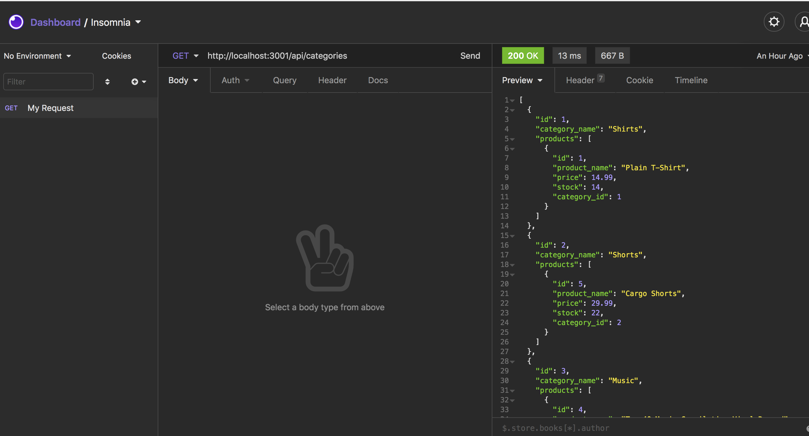

# (ORM): E-Commerce Back End 

# Description

    To build the back end for an e-commerce site by modifying starter code. You’ll configure a working Express.js API to use Sequelize to interact with a MySQL database.

# Table of Contents

- [Installation](#installation)
- [Usage](#usage)
- [Contributed](#contributed)
- [License](#license)
- [Questions](#questions)

# Installation

npm install

# Usage

Npm mysql Node

# Contributed

Contributers: jose orozco

# License

This application is protected under conditions of the MIT license.

# Questions

My Github Profile: http://www.github.com/jose8160  
 If there are any questions contact
jose816orozco@gamil.com
